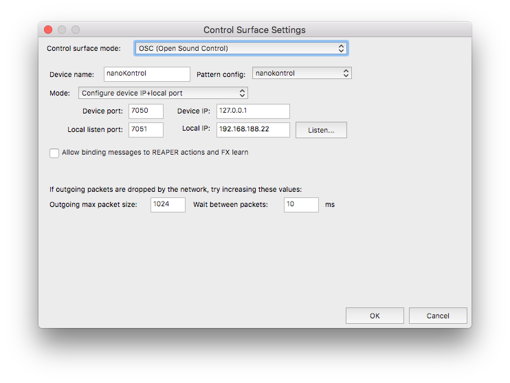

# Korg nanoKONTROL2 as a Reaper OSC control surface

Enables using a [Korg nanoKONTROL2](https://www.korg.com/products/computergear/nanokontrol2/) to control [Reaper](https://reaper.fm/).

Tested under macOS 10.13 with Reaper 6.13.

## Features

* Faders control track volume
* Knobs control track pan
* S/M/R buttons toggle solo/mute/record-arm (and light up according to the Reaper status)
* Transport buttons control stop/play/record; hold down rewind/forward to move the Reaper cursor backwards/forwards
* Marker set/prev/next works
* Cycle button toggles repeat  (and lights up according to the Reaper status)
* Track prev/next buttons go to start/end of the project for now.
  (You could e.g. implement a bank up/down functionality to handle more than 8 tracks, 
   but it'd be a bit of effort, since you'd have to keep track of all the mute states yourself, so you can update the hardware on each bank change. 
   Also there's no good way to indicate which bank you're currently on, so I'm not sure it'd be all that helpful.)

## Setup

**NOTE**: Before using this, see if one of the (less complex) alternatives mentioned below works for your use case!

### Set hardware to "MIDI Control Change" mode

Hold the set-marker and cycle buttons before plugging in the USB cable.

### Configure hardware buttons to be toggles

* Download the [KORG KONTROL Editor](https://www.korg.com/us/support/download/product/0/159/) program
* Set the S/M/R buttons and the "cycle" button behavior to "toggle" (instead of the default "momentary")
* Set the LED mode to "external"
* Write changes to device (Communication::Write Scene Data)

See these [screenshots](https://github.com/Pierousseau/reaper_generic_control/blob/master/README.md#how-do-i-use-it-) for details, and/or use my `toggle.nktrl2_data` file.

### Set up OSC device for Reaper

* Copy `nanokokontor.ReaperOSC` to the `$REAPER/OSC` folder (Options::Show Reaper resource path)

### Set up OSC/MIDI converter

* Download oscii-bot from https://www.cockos.com/oscii-bot/
* Copy `nanokontrol.c` to `~/Library/Application\ Support/OSCII-bot/nanokontrol.txt`
* Start oscii-bot

### Add control surface

* Go to Preferences::Control/OSC/web and click "add"
* Set mode to "OSC" and the ports to match the ones specified in `nanokontrol.c`

## Alternatives

### Reaper built-in control modes

Before you use this, first see if the simpler, Reaper built-in mechanisms works for you, as recommended e.g. [here](https://songwritingandrecordingtips.wordpress.com/2012/04/21/recording-using-a-korg-nanokontrol-2-with-reaper/),
namely add a "control surface" in the Preferences::Control/OSC/web section, using

* "Mackie Control Universal" mode (set the hardware to "Sonar" by holding set-marker+record button s before plugging it in)
* "HUI (partial)" mode (set hardware to "Protools" with set+play)

In HUI mode, the "cycle" or "marker" buttons were non-functional for me, which is a pity.

In Mackie mode moving one fader sometimes also changed the volume of *other* tracks for me, which makes it completely unusable for me.

Windows users may have better luck with the ["Klinke" enhanced Mackie mode plugin](https://bitbucket.org/Klinkenstecker/csurf_klinke_mcu/downloads/)
(see also [the introductory forum post](https://forum.cockos.com/showthread.php?t=81818)).

### Reaper MIDI input

* Set the device up as a MIDI controller, by enabling "input" and "control" messages under Preferences::Audio::MIDI.
* Assign functionality to the individual controls by using the "Actions" menu, and/or import a [ready-made keymap](https://forum.cockos.com/showthread.php?t=196669)

This setup has the **major drawback** of being input only, i.e. Reaper does not send changes performed in its UI to the device, so the LED status on the hardware will likely diverge rather quickly.
So this is only an option if you *only ever* are going to use the hardware controls.

### Custom MIDI control mode (Windows)

To combat the "input only" design of the built-in MIDI control functionality, Pierre Rousseau created a plugin that provides a ["generic" control surface mode](https://github.com/Pierousseau/reaper_generic_control) ([announcement](https://forum.cockos.com/showthread.php?t=192466)) that allows mapping/customizing of MIDI input/output commands.

However, this plugin currently only works under Windows, not macOS.

### Prior art: OSC control mode

Since I did not think porting the "generic" control mode to macOS would be feasible for me, I went looking for a bidirectional(!) Reaper built-in alternative.

[This forum post](https://forum.cockos.com/showpost.php?p=1413930&postcount=5) confirms that MIDI input is unidirectonal, and points to OSC.
For this we need a bidirectional(!) OSC-MIDI converter.
The directly linked posts were kind of dead ends, but another [forum thread](https://forum.cockos.com/showpost.php?p=1401937&postcount=284) had a complete example, although for a different device, using [oscii-bot](https://www.cockos.com/oscii-bot/).

I guess [Python with liblo/mididings](https://github.com/noedigcode/ArdourSongSwitcher/blob/master/ardourSongSwitcher.py) would also be an acceptable platform,
but oscii-bot already has working macOS integration (and is written in C, thus hopefully less the cause of performance issues), so I went with that.

## Implementation notes

### Concept

We have two jobs here:
1. Define the OSC protocol Reaper uses for reading and writing
2. Translate between these OSC messages and the hardware's MIDI messages

### OSC definition

There is rather little documentation, I've cobbled my settings together from the (at least well-commented) `Default.ReaperOSC` file.
Luckily, the nanoKontrol is a rather simple device, so we don't need most of the metadata settings/functions like "device track count", and only a handful of main function verbs.

In addition to the predefined control surface functions, which are mostly read and write (e.g. "track volume", "start/stop playback", "start/stop recording"),
Reaper exposes *any* action for writing (i.e. triggering) with the `ACTION` verb.
This requires an integer parameter to identify the action you want to perform,
which you can get from the "Actions" menu by right-clicking an action and selecting "Copy selected action command ID".

### oscii-bot language

[API Documentation](https://www.cockos.com/oscii-bot/oscii-bot-doc.html)

An oscii-bot program consists of sections:

* Input/output declarations (`@input`, `@output`)
* Initialization (`@init`)
* "on receiving an OSC message" (`@oscmsg`)
* "on receiving a MIDI message" (`@midimsg`)

There is no `if` statement, instead the ternary operator is (ab-) used::

    msg2 == 42 ? (
      calculate_values()
      do_stuff()
    )

#### OSC

Receiving::

    oscmatch("/track/%d/mute", track) ? (
      state = oscparm(0);
      printf("mute of track %d was set to %d", track, state);
    )

* Parameters in the "URL" are extracted via format string (like `printf`)
* The Value(s) are accessed by index with `oscparm()`

Sending::

    oscsend(DEVICE, "b/track/%d/mute", 0, track);

The ordering of the function parameters to `oscsend()` is a little peculiar:
`oscsend(device, url, value, [value...,] parameter, [parameter...])`,
i.e. the "URL" parameters go at the end of the varargs.

#### MIDI

MIDI messages are split into 3 built-in global variables, `msg1`, `msg2` and `msg3` on receive,
and those same variables must be set before calling `midisend(DEVICE)`.

* `msg1` is the "type" (nanoKontrol only uses "control change" 0xb0==176)
* `msg2` is the "control number" (can be assigned via the KONTROL Editor software)
* `msg3` is the value

With the LED mode set to "external", we can turn the button-LEDs on and off by sending a corresponding control change with either 0 or "max value" (127 by default).
See the [parameter guide](https://www.korg.com/us/support/download/product/0/159/) for details.
